# 🌹 Азбука Роз

[](https://developer.mozilla.org/ru/docs/Web/HTML)
[](https://developer.mozilla.org/ru/docs/Web/CSS)
[](https://developer.mozilla.org/ru/docs/Web/JavaScript)
[](LICENSE)
[](https://natalyasvetlakova.github.io/Roses-catalog/)
[](#)

Интерактивный каталог сортов роз с фильтрацией, рейтингами, отзывами садоводов и поддержкой тёмной темы.

Пет-проект, созданный, чтобы показать умение строить многостраничные сайты с динамическим контентом, работой с данными, состоянием и адаптивной вёрсткой — без фреймворков и рекламы, на чистом HTML, CSS и JavaScript.

🔗 **Демо:** https://natalyasvetlakova.github.io/Roses-catalog/

---

## 📸 Скриншоты

### Главная (светлая тема)

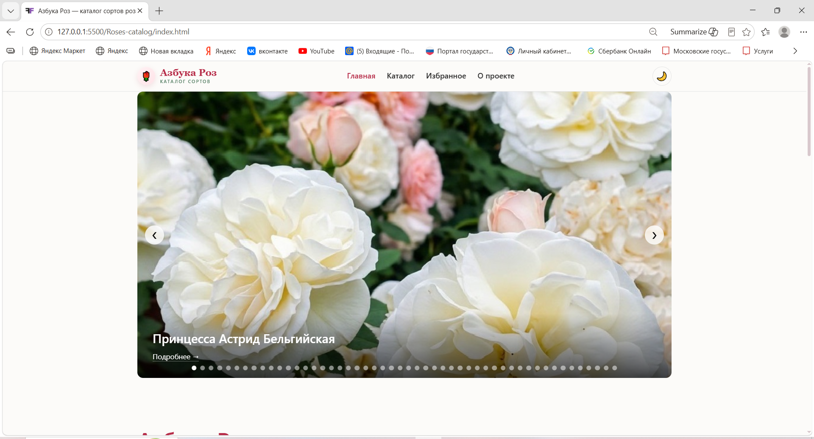
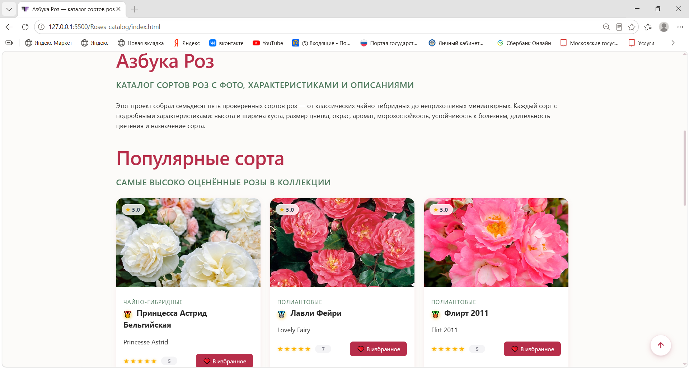
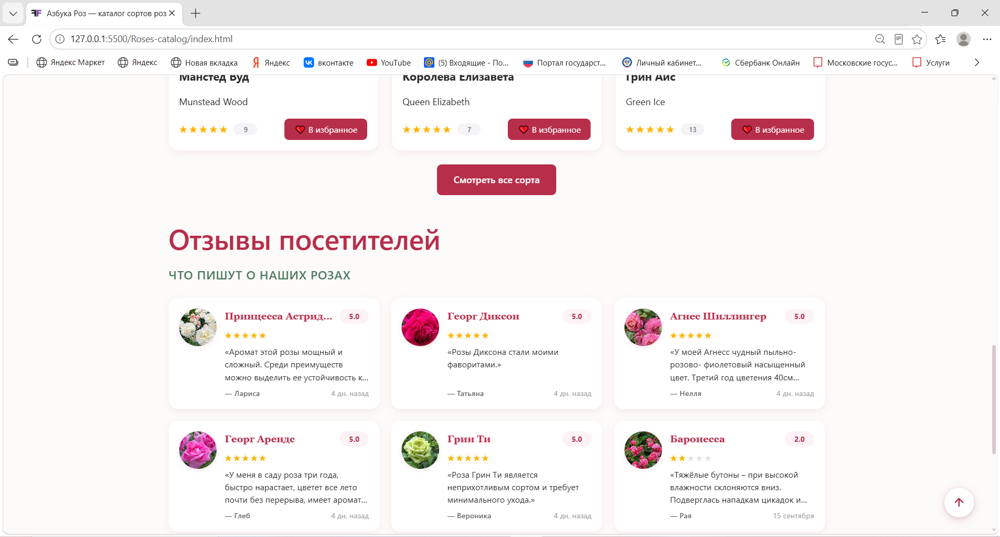

### Каталог (светлая тема)

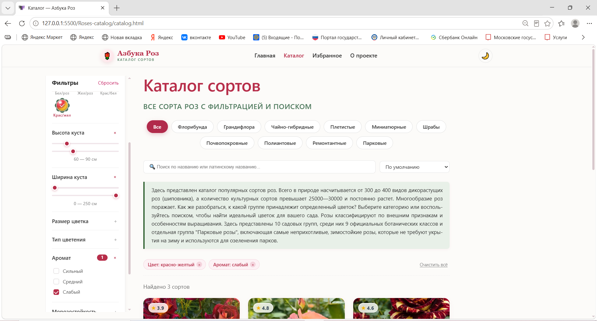
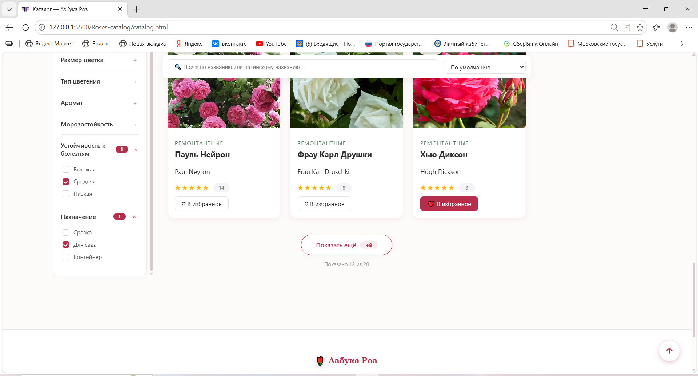


### Страница сорта (светлая тема)

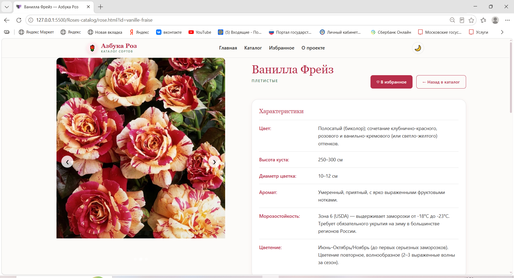


### Избранное (светлая тема)

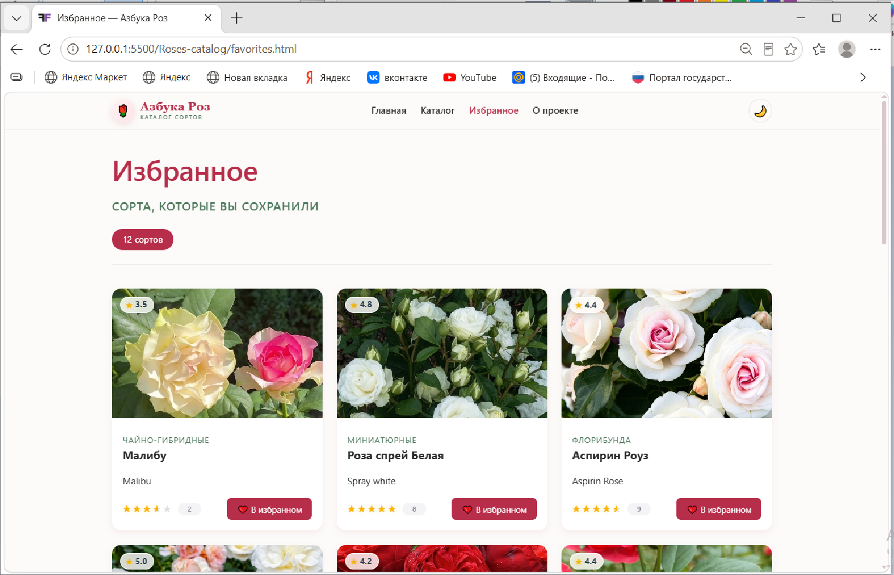

### Главная (тёмная тема)

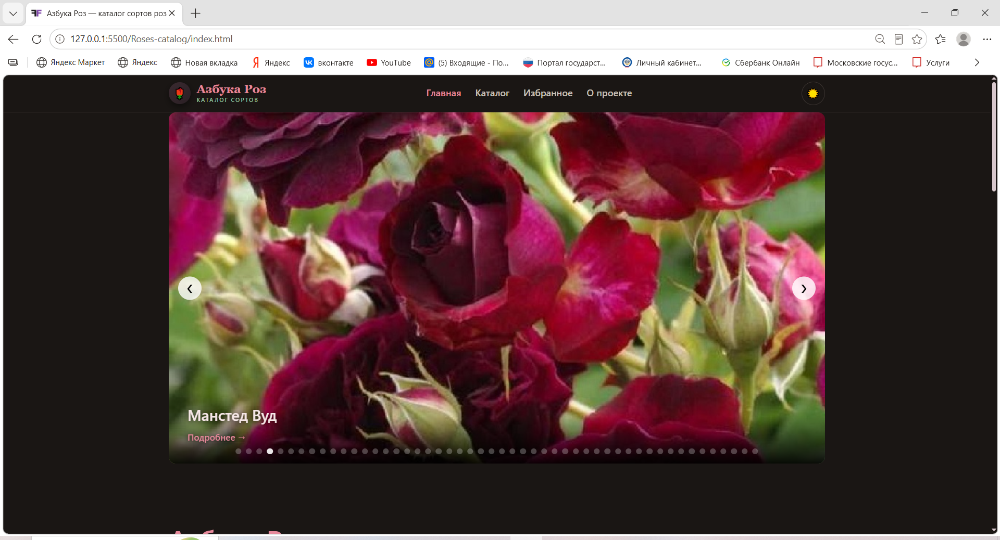
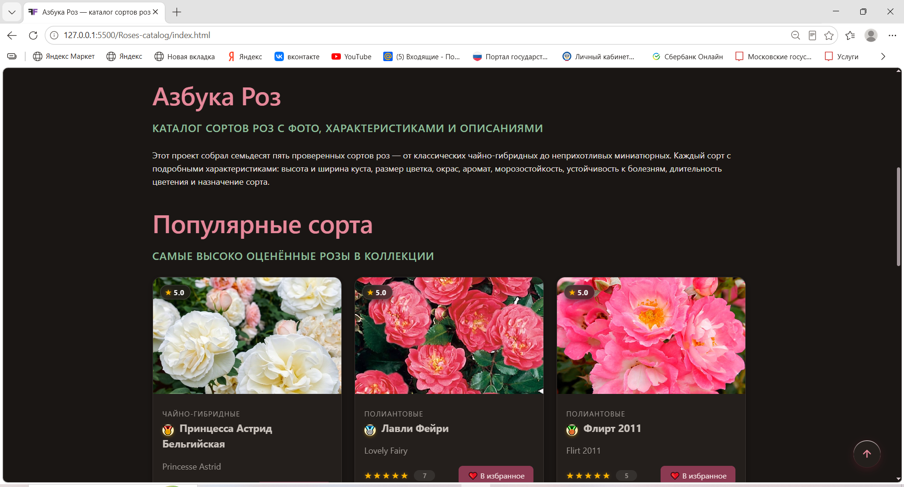
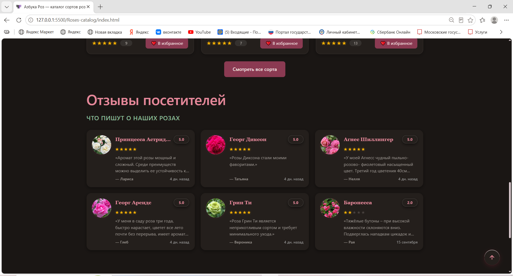

### Каталог (тёмная тема)

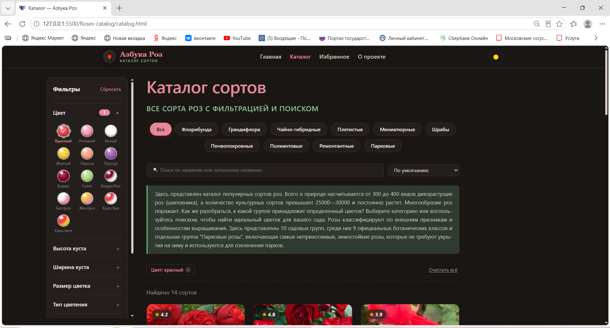
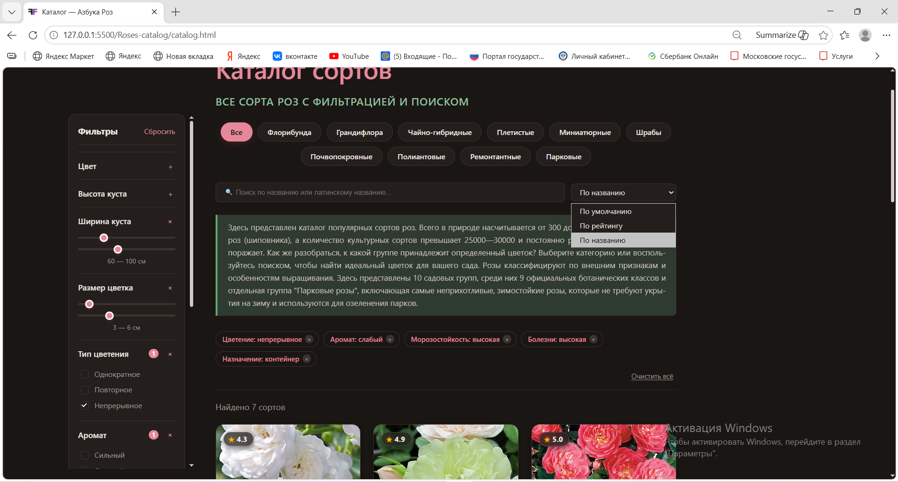
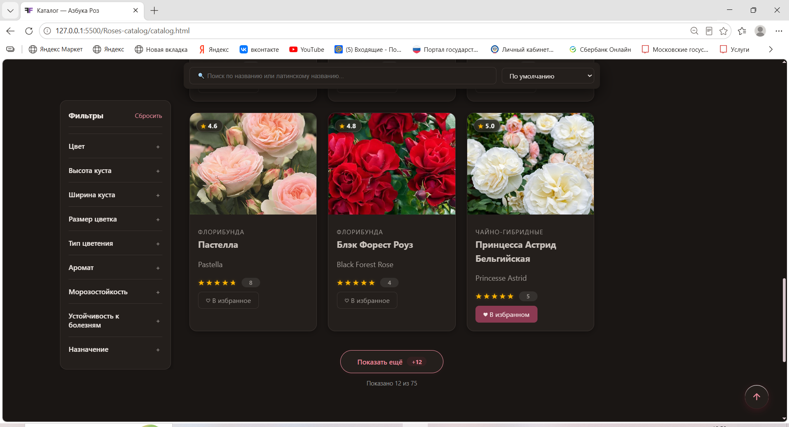

### Страница сорта (тёмная тема)

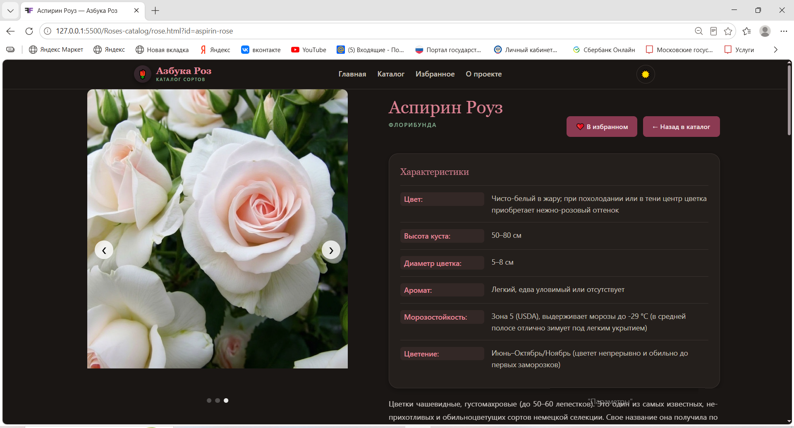
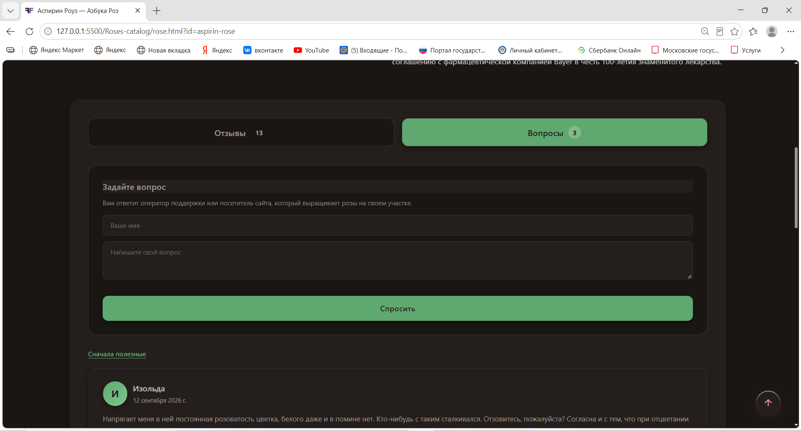
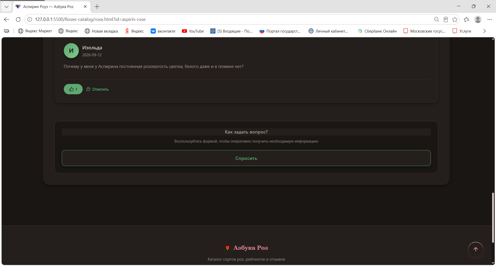

### Избранное (тёмная тема)

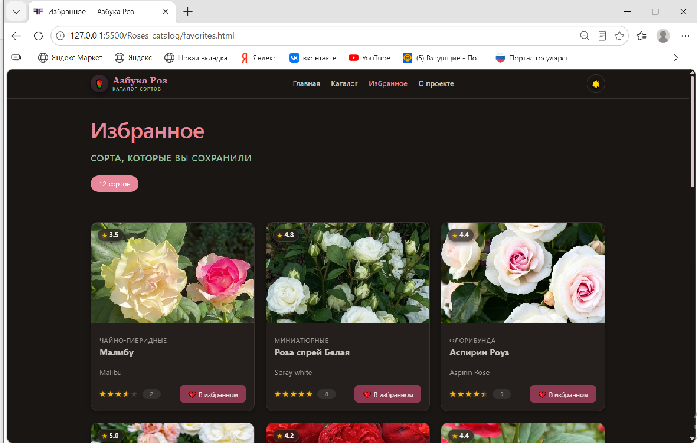

---

## ✨ Возможности

### Каталог

- Фильтрация по 9 параметрам: цвет, высота и ширина куста, размер цветка, тип цветения, аромат, морозостойкость, устойчивость к болезням, назначение.
- Живой поиск по русскому и латинскому названию сорта.
- Сортировка по умолчанию, по рейтингу и по названию.
- Активные фильтры — чипы с возможностью снять любой фильтр одним кликом.
- Кнопка «Сбросить всё» для быстрого возврата к исходному списку.
- Пагинация «Показать ещё» — список сортов подгружается порциями.

### Страница сорта

- Слайдер с фотографиями и переключением точек/стрелок.
- Таблица характеристик по 12 параметрам.
- Кнопки «В избранное» и «Оставить отзыв».
- Раздел отзывов и вопросов садоводов с рейтингом.
- Динамическая подгрузка данных по URL-параметру (`rose.html?id=grand-prix`).

### Избранное

- Сохранение любимых сортов в `localStorage`.
- Отдельная страница с карточками избранного.
- Анимация удаления, счётчик, пустое состояние с иллюстрацией.

### Отзывы и рейтинги

- Вкладки «Отзывы» и «Вопросы».
- Форма добавления отзыва с оценкой звёздами.
- Голосование «Полезно / Не полезно».
- Ответы на вопросы с формой reply.
- Сводная карточка рейтинга с распределением по звёздам.

### Дизайн и UX

- 🌗 Тёмная и светлая темы с переключением одной кнопкой и сохранением выбора в `localStorage`.
- 📱 Адаптивная вёрстка — от широких мониторов до смартфонов.
- 🍔 Бургер-меню на мобильных.
- ✨ Премиум-анимации: 3D-свотчи цветов, бегущая строка с фото, карточки с hover-эффектами.
- ⬆️ Кнопка «Наверх» с плавным появлением при скролле.
- 🎨 Единая дизайн-система через CSS-переменные.

---

## ⚡ Производительность

Проверено в Chrome DevTools (Lighthouse → Performance):

| Метрика | Значение | Оценка |
|---|---|---|
| LCP (Largest Contentful Paint) | 0.14 s | ✅ |
| CLS (Cumulative Layout Shift) | 0 | ✅ |
| INP (Interaction to Next Paint) | 48 ms | ✅ |

Все три Core Web Vitals — в зелёной зоне с большим запасом.

---

## 🛠 Технологии

| Слой | Стек |
|---|---|
| Разметка | HTML5: семантика, ARIA |
| Стили | CSS3: Flexbox, Grid, CSS-переменные, `color-scheme` и переключение темы через `data-theme`, `clamp()`, `aspect-ratio`, `:has()`, `mask-image`, `backdrop-filter`, медиа-запросы |
| Логика | JavaScript (ES6+): `fetch`, массивы, `URLSearchParams`, `IntersectionObserver` |
| Хранение | `localStorage` — тема, избранное, отзывы пользователя |
| Сборка | Без сборщиков — только VS Code + Live Server |
| Хостинг | GitHub Pages |

Осознанно без фреймворков — чтобы показать владение базовым стеком.

---

## 📁 Структура проекта

```
Roses-catalog/
├── index.html              # Главная: слайдер, популярные сорта, отзывы
├── catalog.html            # Каталог с фильтрами и поиском
├── rose.html               # Страница сорта (по URL-параметру ?id=)
├── favorites.html          # Избранное (localStorage)
├── about.html              # О проекте
│
├── css/
│   └── style.css           # Основные стили + тёмная тема
│
├── data.json               # Данные: 75 сортов + категории
│
├── js/
│   ├── data-loader.js      # fetch('data.json') → window.rosesReady
│   ├── data-logic.js       # RoseRatings, вспомогательные утилиты
│   ├── theme.js            # Переключение темы + localStorage
│   ├── catalog.js          # Фильтры, поиск, сортировка, пагинация
│   ├── rose.js             # Логика страницы сорта
│   ├── rose-tabs.js        # Вкладки «Отзывы/Вопросы» + синхронизация формы с RoseRatings
│   ├── home.js             # Слайдер и карточки на главной
│   ├── home-reviews.js     # Блок «Последние отзывы» на главной
│   ├── favorites.js        # Избранное + логика favorites.html
│   ├── reviews.js          # Отзывы: добавить / удалить / рейтинг
│   ├── qna.js              # Вопросы и ответы в localStorage
│   ├── slider.js           # Класс RoseSlider
│   └── scroll-top.js       # Кнопка «Наверх»
│
├── img/                    # Фотографии роз (.webp)
│
├── docs/
│   └── screenshots/        # Скриншоты светлой и тёмной тем
│
├── README.md
├── CONTRIBUTING.md         # Как внести вклад
├── CHANGELOG.md            # История изменений
├── LICENSE                 # Лицензия MIT
└── .gitignore              # Что не коммитим
```

---

## 🌐 Поддержка браузеров

| Браузер | Версия | Статус |
|---|---|---|
| Chrome / Edge | 120+ | ✅ Полная поддержка |
| Firefox | 121+ | ✅ Полная поддержка |
| Safari | 17+ | ✅ Полная поддержка |
| Internet Explorer | любой | ❌ Не поддерживается |

Проект использует современные CSS-функции (`:has()`, `aspect-ratio`, `backdrop-filter`, `mask-image`) и JavaScript-API (`fetch`, `IntersectionObserver`). IE снят с поддержки Microsoft в 2022 году и не умеет работать с этими технологиями.

---

## 🚀 Запуск проекта локально

### 1. Клонировать репозиторий

```bash
git clone https://github.com/NatalyaSvetlakova/Roses-catalog.git
cd Roses-catalog
```

### 2. Открыть в браузере

Самый простой способ — открыть `index.html` двойным кликом.

### 3. (Рекомендуется) Через Live Server

Для корректной работы `fetch` к JSON-файлам нужен локальный сервер.

**Через VS Code:**

1. Установите расширение **Live Server**.
2. Кликните правой кнопкой на `index.html` → **Open with Live Server**.
3. Сайт откроется на `http://127.0.0.1:5500/`.

**Через Python:**

```bash
python -m http.server 5500
```

---

## 🎨 Дизайн-система

### Цвета — светлая тема

| Переменная | Значение | Назначение |
|---|---|---|
| `--color-bg` | `#fcfbf9` | Основной фон |
| `--color-bg-card` | `#ffffff` | Карточки, панели |
| `--color-text` | `#2b2b2b` | Основной текст |
| `--color-primary` | `#b72e4a` | Фирменный винный |
| `--color-secondary` | `#4f7a5e` | Спокойный зелёный |

### Цвета — тёмная тема

| Переменная | Значение | Назначение |
|---|---|---|
| `--color-bg` | `#1a1614` | Тёплый почти-чёрный |
| `--color-bg-card` | `#241f1c` | Карточки |
| `--color-text` | `#ece6e2` | Тёплый белый |
| `--color-primary` | `#e6889a` | Розовый (осветлённый винный) |
| `--color-secondary` | `#8fbf9c` | Светло-зелёный |

### Шрифты

- **Заголовки:** `Georgia, 'Times New Roman', serif`
- **Основной текст:** `system-ui, -apple-system, 'Segoe UI', Roboto, Arial, sans-serif`

### Скругления и тени

- `--radius: 16px` — крупные блоки
- `--radius-sm: 8px` — кнопки, поля
- `--shadow-sm` и `--shadow-lg` — мягкие тени в цвет бренда

---

## 📱 Адаптивность

Проект свёрстан по принципу **mobile-first** и протестирован на:

| Устройство | Ширина | Что меняется |
|---|---|---|
| Телефон | ≤ 480px | Одноколоночная сетка, бургер-меню, скрытые подписи |
| Планшет | 481–900px | Двухколоночный каталог, выезжающий сайдбар фильтров |
| Ноутбук | 901–1400px | Полноценный каталог с сайдбаром, 3 карточки в ряд |
| Монитор | ≥ 1400px | Максимальная ширина 1500px, воздух вокруг контента |

---

## ♿ Доступность

- Семантические теги `<header>`, `<nav>`, `<main>`, `<article>`, `<footer>`.
- ARIA-атрибуты: `aria-label`, `aria-hidden`, `role` для слайдера.
- Фокус с клавиатуры — везде, где есть интерактив.
- Контраст текста соответствует WCAG AA.
- Поддержка `prefers-reduced-motion` для отключения анимаций.
- Поддержка `prefers-color-scheme` — если пользователь выбрал тёмную тему в ОС, сайт её подхватит.

---

## 📄 Лицензия

Проект распространяется под лицензией **MIT** — вы можете свободно использовать код в своих целях с указанием авторства. Полный текст — в файле [LICENSE](LICENSE).

---

## 👤 Автор

**Наталья Светлакова**  
Web Developer · Pet-project · 2026

- 🐙 GitHub: [@NatalyaSvetlakova](https://github.com/NatalyaSvetlakova)
- 🌐 Проект на GitHub Pages: [natalyasvetlakova.github.io/Roses-catalog](https://natalyasvetlakova.github.io/Roses-catalog/)

---

## 🏷 Topics

`html` · `css` · `javascript` · `vanilla-js` · `catalog` · `roses` ·
`dark-theme` · `css-variables` · `localstorage` · `pet-project` ·
`responsive-design` · `github-pages` · `no-frameworks`